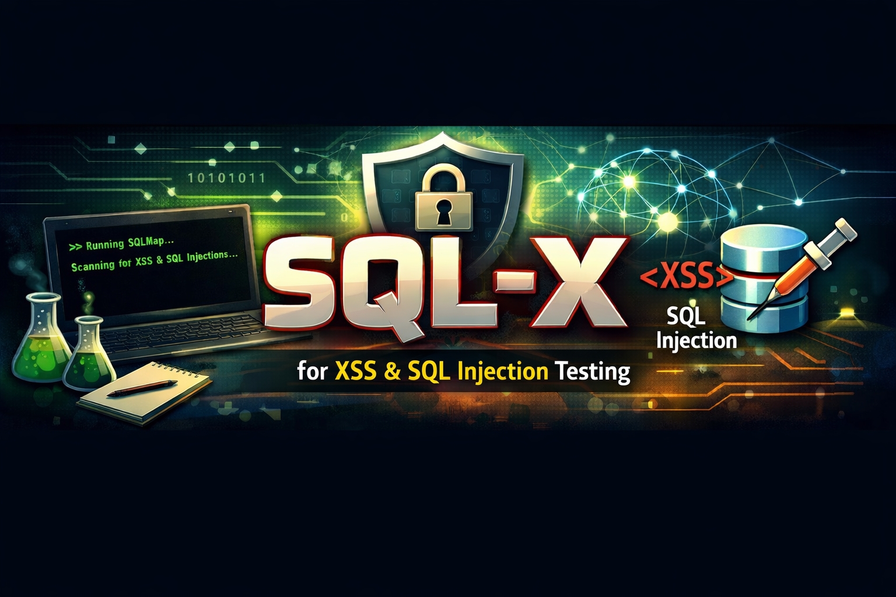

# Projeto SQLX
### by Hanamaru

- SQLX é um scan de SQLI e XSS, serve para orquestração do SQLMAP e gera um relatório com as saídas ao final da execução.

- DISCLAIMER: Esse programa foi desenvolvido para fins de estudo e pesquisa, não me responsabilizo por qualquer uso de má fé que venha a comprometer qualquer aplicação, use apenas para o desenvolvimento de conhecimento e não abuse do uso para prejudicar os outros, teste em ambiente controlado.


###### (Projeto em desenvolvimento)

---

## Modo de Uso

###### Debian e Derivados

- Crie uma venv(A execução em venv já é um padrão e boa pratica para não afetar seu ambiente).

Comando para criar venv:
```
python3 -m venv venv

```

- Ative a venv.

Comando para ativar a venv
```
source venv\bin\activate

```

- Instale as dependências.

Comando para ativar as dependências:

```
pip3 install -r requirements.txt

```

- Uso do programa

Comando para uso do programa:
```
python3 sqlx.py --url http://exemplo.com

```

---


###### Arch Linux e Derivados


- Crie uma venv(A execução em venv já é um padrão e boa pratica para não afetar seu ambiente).

Comando para criar venv:
```
python -m venv venv

```

- Ative a venv.

Comando para ativar a venv
```
source venv\bin\activate

```

- Instale as dependências.

Comando para ativar as dependências:

```
pip install -r requirements.txt

```

- Uso do programa

Comando para uso do programa:
```
python sqlx.py --url http://exemplo.com

```

---

- Feito isso ele irá gerar o relatorio na pasta repors dentro da pasta do programa o relatorio é gerado noformato sqlx_report_data-hora.txt

- Em versões futuras irei implementar para que esse relatório seja gerado em markdown.
